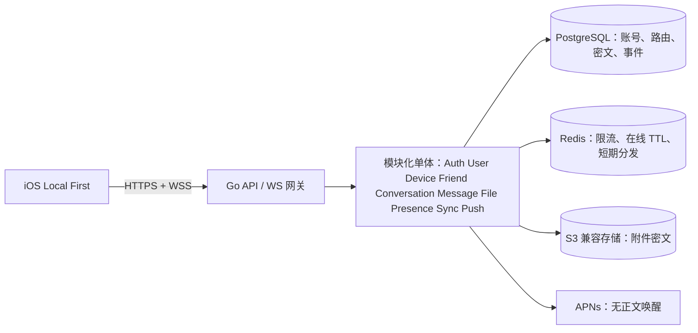

# 未来后端架构

**状态：架构设计基线。** 仓库现有独立 `backend/` 模块化单体基础服务；iOS 客户端仍未连接。本文包含尚未实现的生产能力，具体已实现范围见 [后端 README](../../backend/README.md)。

Go 便于在单进程中实现明确接口、并发连接和可观测性；PostgreSQL 提供事务、唯一约束和按设备有序事件；Redis 仅保存可重建的短期状态，不作消息唯一真实来源；S3 兼容存储适合大密文对象和未来分片上传；WebSocket 缩短在线延迟，APNs 唤醒离线设备。先用模块化单体保证跨模块事务和部署简洁，只有瓶颈经测量证实后再拆服务。

## 模块边界

| 模块 | 职责 |
| --- | --- |
| Auth | 注册挑战、设备签名认证、短期访问令牌、刷新令牌轮换与撤销。 |
| User | UserID 唯一化、资料、可搜索开关与精确发现。 |
| Device | 设备公钥、授权、撤销、预密钥目录、APNs token 关联。 |
| Friend | 请求、接受、阻止/删除、反骚扰策略。 |
| Conversation | 成员与设备投递目标、权限检查；第一版只支持一对一。 |
| Message | 校验密文信封、存储、编辑/删除墓碑、回执与回应元数据。 |
| File | 上传票据、密文对象与所有权、生命周期。 |
| Presence | Redis 心跳、授权可见性、短暂输入提示。 |
| Sync | 每设备事件序列、游标拉取、确认、幂等与断线重试。 |
| Push | 从持久事件发出无正文 APNs 提示，失败可重试。 |

## 主数据流

设备以签名挑战获得访问令牌；发送前客户端按未来已审计的 E2EE 协议给每个目标设备封装密文；Message 在事务中写入密文信封和各接收设备 SyncEvent；在线设备接收 WebSocket 提示后按游标拉取，离线设备由 APNs 唤醒后也走同一游标；接收端本地解密并在策略允许时提交已送达/已读事件。文件先由客户端加密，再用短时上传票据写入对象存储；服务端只记录密文大小、哈希和对象键。

任何服务器侧日志、追踪、审计记录只写操作 ID、结果和必要网络元数据，不写 token、密文正文或密钥材料。线上认证与密钥目录还需独立安全审查，见[威胁模型](../Security/Threat_Model.md)。
