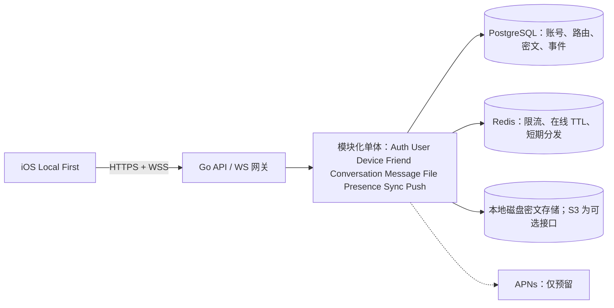

# 未来后端架构

**状态：设计与现有实现并存。** `backend/` 有可运行的模块化单体基础服务，iOS 已有显式在线连接入口。本图含尚未启用的 APNs 和可选 S3；当前本地联调及部署配置使用本机或 VPS 磁盘保存密文文件。生产部署、双实体设备闭环和独立安全审计尚未完成，具体已实现范围见 [后端 README](../../backend/README.md)。

Go 在单进程中提供明确接口和并发连接；PostgreSQL 提供事务、唯一约束和按设备有序事件；Redis 保存可重建的短期状态，不作消息唯一真实来源；本地磁盘是当前密文对象存储，S3 兼容接口保留给未来；WebSocket 发送实时提示，APNs 仍为预留。先保持模块化单体，仅在测量证实瓶颈后拆分。

## 模块边界

| 模块 | 职责 |
| --- | --- |
| Auth | 注册挑战、设备签名认证、短期访问令牌、刷新令牌轮换与撤销。 |
| User | UserID 唯一化、资料、可搜索开关与精确发现。 |
| Device | 设备公钥、授权、撤销、预密钥目录、APNs token 关联。 |
| Friend | 请求、接受、阻止/删除、反骚扰策略。 |
| Conversation | 成员与设备投递目标、权限检查；第一版只支持一对一。 |
| Message | 校验密文信封、存储、编辑/删除墓碑、回执与回应元数据。 |
| File | 上传票据、密文对象与所有权、生命周期。 |
| Presence | Redis 心跳、授权可见性、短暂输入提示。 |
| Sync | 每设备事件序列、游标拉取、确认、幂等与断线重试。 |
| Push | 从持久事件发出无正文 APNs 提示，失败可重试。 |

## 主数据流

设备以签名挑战获得访问令牌；显式在线 v4 模式在客户端为每个目标设备封装密文；Message 在事务中写入密文信封和各接收设备 SyncEvent；在线设备接收 WebSocket 提示后按游标拉取，离线设备恢复连接后也走同一游标。接收端本地解密，并在隐私设置允许时提交密文已读事件。文件由客户端加密后经受控 API 上传密文；服务端记录密文大小、哈希和对象键。APNs 发送与独立协议审计尚未完成。

任何服务器侧日志、追踪、审计记录只写操作 ID、结果和必要网络元数据，不写 token、密文正文或密钥材料。线上认证与密钥目录还需独立安全审查，见[威胁模型](../Security/Threat_Model.md)。
